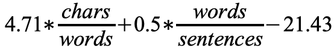

## Development - Advanced, exercise 1

### Text
The *automated readability index* (ARI) is a readability test for English texts, designed to gauge the understandability of a text by representing the US grade level needed to comprehend such text. The formula for calculating the ARI is the following one:



where *chars* is the number of letters and numbers, *words* is the number of token, and *sentences* is the number of sentences. Non-integer scores are always rounded up to the nearest whole number, so a score of 10.1 or 10.6 would be converted to 11.

Write the body of a Python function which takes a string representing a text in input and returns the ARI for that text. As a simplification, the input text can be composed only by English characters, numbers, commas, semicolons, colons, and full stops, and no abbreviation (such as “e.g.”) can be used.

### Solution
```python
from math import ceil
from re import sub


# Test case for the function
def test_ari(text, expected):
    result = ari(text)
    if expected == result:
        return True
    else:
        return False


# Code of the function
def ari(text):
    num_char = len(sub("[^A-z0-9]", "", text))
    num_word = len(text.split())
    num_sent = len(sub("[^\\.]", "", text))
    ari_value = (4.71 * (num_char / num_word)) + (0.5 * (num_word / num_sent)) - 21.43
    return ceil(ari_value)


# Tests
print(test_ari("This is just a string.", -2))
print(test_ari("Semantic Publishing involves the use of Web and Semantic Web technologies and standards for the " \
               "semantic enhancement of a scholarly work so as to improve its discoverability, interactivity, " \
               "openness and (re-)usability for both humans and machines. Recently, people have suggested that " \
               "the semantic enhancements of a scholarly work should be undertaken by the authors of that scholarly " \
               "work, and should be considered as integral parts of the contribution subjected to peer review. " \
               "However, this requires that the authors should spend additional time and effort adding such semantic " \
               "annotations, time that they usually do not have available. Thus, the most pragmatic way to " \
               "facilitate this additional task is to use automated services that create the semantic annotation " \
               "of authors' scholarly articles by parsing the content that they have already written, thus reducing " \
               "the additional time required of the authors to that for checking and validating these semantic " \
               "annotations. In this article, I propose a generic approach called compositional and iterative " \
               "semantic enhancement (CISE) that enables the automatic enhancement of scholarly papers with " \
               "additional semantic annotations in a way that is independent of the markup used for storing " \
               "scholarly articles and the natural language used for writing their content.", 25))
``` 

### Additional material
The runnable [Python file](exercise_1.py) is available online.
