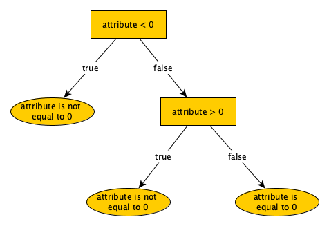

## Development - Advanced, exercise 22

### Text
A **decision tree** is a flowchart-like structure in which each internal node represents a test on an attribute (e.g. whether a coin flip comes up heads or tails), each branch represents the outcome of the test, and each leaf node represents a class label (i.e. decision taken after computing all attributes). The paths from root to leaf represent classification rules. An example of decision tree is shown as follows:

<p style="text-align:center;">
    
</p>

The decision tree above allows one to check whether a given number (identified by the variable `attribute`) is equal to 0. For checking this, supposing to execute such a decision tree passing the number 3 as input, one has (a) to start from the root, (b) to execute the condition (i.e. 3 < 0), (c) to follow the related branch (i.e. *false*), and (d) to repeat again the process if we arrived in an inner node or (e) to return the result if we arrived in a leaf node.
As shown in the figure, in a decision tree each internal node has always two children: the left one is reached when the condition the internal node specifies is *true*, while the right one is reached when the condition the internal node specified is *false*.

Write an algorithm in Python – `def exec_dt(decision, attribute)` – which takes in input a tree `decision` (which is represented by the root node of the tree defined as an object of the class anytree.Node) describing a decision tree, in which the name of each non-leaf node in the tree is a Python function – it means that we can see the node name as a function that can be executed by passing an input, e.g. considering the node `n`, we can call the function specified as its name passing the input between parenthesis, as usual: `n.name(56)`. Each Python function, to execute using attribute as input, returns either `True` or `False` if the condition defined by that function is satisfied or is not satisfied respectively. The algorithm return the leaf node reached by executing the decision tree with the value in `attribute`.


### Solution
```python
from anytree import Node


# Test case for the function
def test_exec_td(decision, attribute, expected):
    result = exec_td(decision, attribute)
    if expected == result:
        return True
    else:
        return False


# Code of the function
def exec_td(decision, attribute):
    if decision.children:
        if decision.name(attribute):
            return exec_td(decision.children[0], attribute)
        else:
            return exec_td(decision.children[1], attribute)
    else:
        return decision


# Tests
attr_equal = "attribute is equal to 0"
attr_not_equal = "attribute is not equal to 0"

root = Node(lambda x: x < 0)
root_left = Node(attr_not_equal, root)
root_right = Node(lambda x: x > 0, root)
root_right_left = Node(attr_not_equal, root_right)
root_right_right = Node(attr_equal, root_right)

print(test_exec_td(root, 0, root_right_right))
print(test_exec_td(root, 5, root_right_left))
print(test_exec_td(root, -10, root_left))
``` 

### Additional material
The runnable [Python file](exercise_22.py) is available online.
