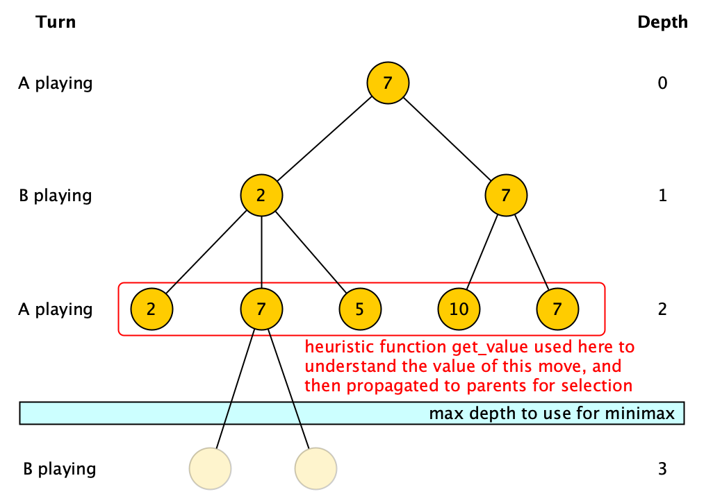

## Development - Advanced, exercise 26

### Text
A **minimax** is a recursive algorithm for choosing the next move in a two-player (A and B) game like chess, where all the possible configurations of the board are described as nodes in a tree of moves. A value is associated with each configuration (i.e. each node) and indicates how good it would be for a player (either A or B, depending on the turn) to reach that configuration. If it is A's turn to move, A gives a value to each of its legal moves, i.e. the child nodes of the one describing the current configuration. The best value for A is the **maximum** of the values of the children of the configuration in which A has to play, while the best value for B is the **minimum** of the values of the children of the configuration in which B has to play.

The minimax uses a heuristic function `get_value` **only** when a **terminal node** of the tree of moves is reached or when **nodes at the maximum search depth** are reached (the maximum depth is specified as input to the algorithm). The other non-leaf nodes inherit their value from a descendant leaf/max-depth node, i.e. either the maximum of the values of the children if A is playing or the minimum of the values of the children if B is playing.

<p style="text-align:center;">
    
</p>

Write an algorithm in Python – `def minimax(node, max_depth, player_a_moves)` – which takes in input a node of the tree of moves, the maximum depth to consider while visiting the tree of moves, and whether the player A is playing (when `player_a_moves` is True) or its opponent is (when `player_a_moves` is False), and returns the heuristic value that will be assigned to the input node. The function `def get_value(node)`, for getting the heuristic value associated with a leaf or a node at maximum depth, and another function `def get_next_valid_moves(node)`, used to get all the moves (i.e. children) of a configuration (i.e. a node), are provided (i.e. they must not be developed) and can be directly used in the implementation of the algorithm. Initially, for instance considering the image above, the algorithm will be called as follows:

```python
minimax(root, 2, True)
```


### Solution
```python
from anytree import Node


# Test case for the function
def test_minimax(node, max_depth, player_a_moves, expected):
    result = minimax(node, max_depth, player_a_moves)
    if expected == result:
        return True
    else:
        return False


# Code of the function
def minimax(node, max_depth, player_a_moves):
    if max_depth == 0 or len(node.children) == 0:
        return get_value(node)
    else:
        move_values = []
        for move in get_next_valid_moves(node):
            move_values.append(minimax(move, max_depth - 1, not player_a_moves))
            
        if player_a_moves:
            return max(move_values)
        else:
            return min(move_values)


# Ancillary functions for granted
def get_value(node):
    d = {
        "Move X": 2,
        "Move Y": 7,
        "Move Z": 5,
        "Move W": 10,
        "Move V": 8
    }
    return d[node.name]


def get_next_valid_moves(node):
    return node.children


# Tests
root = Node("Move Y")
node_1_1 = Node("Move X", root)
node_1_2 = Node("Move Y", root)
node_2_1 = Node("Move X", node_1_1)
node_2_2 = Node("Move Y", node_1_1)
node_2_3 = Node("Move Z", node_1_1)
node_2_4 = Node("Move W", node_1_2)
node_2_5 = Node("Move Y", node_1_2)
node_3_1 = Node("Move Y", node_2_2)
node_3_2 = Node("Move V", node_2_2)

print(test_minimax(root, 0, True, 7))
print(test_minimax(root, 2, True, 7))
print(test_minimax(root, 3, True, 7))
print(test_minimax(root, 7, True, 7))
``` 

### Additional material
The runnable [Python file](exercise_26.py) is available online.
