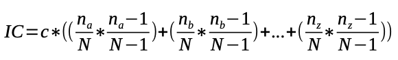

## Development - Advanced, exercise 35

### Text
The **index of coincidence** (IC) provides a measure of how likely it is to draw two matching letters by randomly selecting two letters from a given text. The chance of drawing a given letter in the text is calculated by number of times that letter appears divided by length of the text (excluding spaces and punctuation, and considering all letters in lowercase). The chance of drawing that same letter again (without replacement) is the number of occurrences of that letter minus one, divided by the lengh of the text minus one. The product of these two values gives you the chance of drawing that letter twice in a row. One can find this product for each letter that appears in the text, then sum these products to get a chance of drawing two of a kind. This probability is then be normalized by multiplying it by some coefficient c dependant of the language of the text, as shown in the following formula:



where *n<sub>a</sub>* is the number of occurrences of the letter *a* in the text, *n<sub>b</sub>* is is the number of occurrences of the letter *b* in the text, and so on (considering all letters in the alphabeth), and *N* is the total number of letters in the text.
Write an algorithm in Python – `def ic(s, c)` – which takes in input a string `s` representing a text and a number `c` representing the coefficient mentioned in the formula above, and returns a number representing the index of coincidence for the input text.


### Solution
```python
# Test case for the function
def test_ic(s, c, expected):
    result = ic(s, c)
    # For testing it, I've approximated the result to integer
    if int(result) == int(expected):
        return True
    else:
        return False


# Code of the function
def ic(s, c):
    result = 0

    en_alphabeth = "abcdefghijklmnopqrstuvwxyz"
    s_len = 0
    for char in s:
        if char.lower() in en_alphabeth:
            s_len += 1

    for letter in en_alphabeth:
        letter_count = 0
        for char in s:
            if char.lower() == letter:
                letter_count += 1
            result += (letter_count / s_len) * ((letter_count - 1) / (s_len - 1))
    
    return c * result

    
            
# Tests
print(test_ic("Alice was beginning to get very tired of sitting by her sister on the bank, and of having nothing to do", 26, 57))
print(test_ic("This is another text in english", 26, 19))
``` 

### Additional material
The runnable [Python file](exercise_35.py) is available online.
