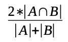

## Development - Advanced, exercise 39

### Text
The **Sørensen–Dice coefficient** is a statistic used to gauge the similarity of two samples, that was intended to be applied to discrete data. Given two sets, A and B, it is defined as twice the number of elements common to both sets divided by the sum of the number of elements in each set, as defined in the following formula:



Write an algorithm in Python – `def sd_coeff(s1, s2)` – which takes in input two sets and returns the number defining the Sørensen–Dice coefficient for those sets.


### Solution
```python
# Test case for the function
def test_sd_coeff(s1, s2, expected):
    result = sd_coeff(s1, s2)
    print(result)
    if result is not None and (round(result, 2) == round(expected, 2)):
        return True
    else:
        return False


# Code of the function
def sd_coeff(s1, s2):
    count = 0
    for i in s1:
        if i in s2:
            count += 1
    
    den = len(s1) + len(s2)

    return (2 * count) / den
    
            
# Tests
print(test_sd_coeff({1, 2, 3}, {1, 2, 3}, 1.0))
print(test_sd_coeff({1, 2}, {1, 2, 3}, 0.8))
``` 

### Additional material
The runnable [Python file](exercise_39.py) is available online.
