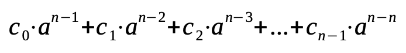

## Development - Advanced, exercise 40

### Text
A **rolling hash** function is a hash function able to convert an input string into an integer representing that string. It is based on multiplications and additions that depend on the number of characters in the input string. In particular, given a string *s* containing *n* characters, the hash value is computed by summing the multiplication involving the integer representation of each character and a coefficient *a* raised to the power of *n* minus the position number next to the current character, i.e.:



where *n* is the length of the input string *s*, *a* is a given constant value, *c<sub>0</sub>* is the integer representation of the character in position 0 of the input string *s*, *c<sub>1</sub>* is the integer representation of the character in position 1 of the input string *s*, *c<sub>2</sub>* is the integer representation of the character in position 2 of the input string *s*, etc.

Write an algorithm in Python – `def rolling_hash(s, a)` – which takes in input a string `s` representing a text and an integer value `a` representing a coefficient used in the formula above, and returns the hash value of that string computed as shown above. Python makes available the builtin function `ord` that takes in input a string of one character and returns the integer representation of that character – e.g. executing `ord("a")` will return the value `97`.


### Solution
```python
# Test case for the function
def test_rolling_hash(s, a, expected):
    result = rolling_hash(s, a)
    if result == expected:
        return True
    else:
        return False


# Code of the function
def rolling_hash(s, a):
    r = 0
    n = len(s)

    for i, c in enumerate(s):
        r += ord(c) * a**(n-(i+1))
    
    return r
    
            
# Tests
print(test_rolling_hash("ciao", 1, 412))
print(test_rolling_hash("ciao", 2, 1517))
print(test_rolling_hash("ciao", 3, 4020))
``` 

### Additional material
The runnable [Python file](exercise_40.py) is available online.
