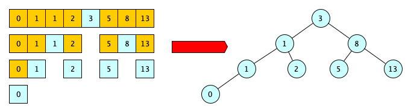

## Development - Advanced, exercise 41

### Text
A binary search tree is a binary tree data structure where each node may have at most two children and the value of each node is greater than (or equal to) all the values in the respective node's left subtree and less than (or equal to) the ones in its right subtree. It can be built, recursively following an approach which recalls the binary search strategy, starting from a list of ordered items (e.g. a list of integers), where each item become a node of a tree.



As a reminder, the binary search strategy first checks if the middle item of a list is equal to item to search for and, in case this is not true, it continues to analyse the part of the list that either preceeds or follows the middle item if it is greater than or less than the item to search.

Write a recursive algorithm in Python – `def create_bst(ordered_list, parent)` – which takes in input an ordered list of integers ordered_list and a parent node `parent`, and returns the root node of the binary search tree created from the input list. In the first call, the function is run passing `None` as input of the second parameter `parent`, e.g. 

```
create_bst([0, 1, 1, 2, 3, 5, 8, 13], None)
```

and returns the binary search tree (i.e. its root node) shown in the example above.


### Solution
```python
from anytree import Node, RenderTree

# Test case for the function
def test_create_bst(ordered_list, parent, expected):
    result = create_bst(ordered_list, parent)
    
    if str(RenderTree(result)) == str(RenderTree(expected)):
        return True
    else:
        return False


# Code of the function
def create_bst(ordered_list, parent):
    cur_len = len(ordered_list)

    if cur_len == 1:
        return Node(ordered_list[0], parent)
    elif cur_len > 1:
        mid = cur_len // 2
        
        r = Node(ordered_list[mid], parent)

        create_bst(ordered_list[:mid], r)
        create_bst(ordered_list[mid+1:], r)
        
        return r


# Tests
print(test_create_bst([9], None, Node(9)))

r1 = Node(5)
Node(1, r1)
Node(9, r1)
print(test_create_bst([1, 5, 9], None, r1))

r2 = Node(5)
r2_1 = Node(3, r2)
Node(1, r2_1)
r2_2 = Node(9, r2)
Node(7, r2_2)
print(test_create_bst([1, 3, 5, 7, 9], None, r2))

r3 = Node(3)
r3_1 = Node(1, r3)
r3_1_1 = Node(1, r3_1)
Node(0, r3_1_1)
Node(2, r3_1)
r3_2 = Node(8, r3)
Node(5, r3_2)
Node(13, r3_2)
print(test_create_bst([0, 1, 1, 2, 3, 5, 8, 13], None, r3))
``` 

### Additional material
The runnable [Python file](exercise_41.py) is available online.
