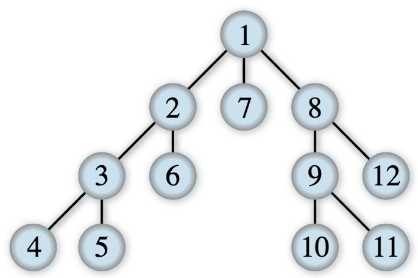

## Development - Intermediate, exercise 3

### Text
Write the body of the Python function `def depth_first_visit(node)` that takes the root node of a tree as input and returns the list of all its nodes ordered according to a depth-first visit. The depth-first visit proceeds as indicated in the [image below](https://en.wikipedia.org/wiki/Depth-first_search#/media/File:Depth-first-tree.svg), created by [Alexander Drichel](https://commons.wikimedia.org/wiki/User:Alexander_Drichel), where the numbers indicate the order in which the nodes should be visited.




### Solution
```python
from anytree import Node


# Test case for the function
def test_depth_first_visit(node, expected):
    result = depth_first_visit(node)
    if expected == result:
        return True
    else:
        return False


# Code of the function
def depth_first_visit(node):
    result = list()
    depth_first_visit_recursive(node, result)
    return result


def depth_first_visit_recursive(node, list):
    list.append(node)
    for child in node.children:
        depth_first_visit_recursive(child, list)


# Tests
n1 = Node(1)
n2 = Node(2, n1)
n3 = Node(3, n2)
n4 = Node(4, n3)
n5 = Node(5, n3)
n6 = Node(6, n2)
n7 = Node(7, n1)
n8 = Node(8, n1)
n9 = Node(9, n8)
n10 = Node(10, n9)
n11 = Node(11, n9)
n12 = Node(12, n8)
print(test_depth_first_visit(n1, [n1, n2, n3, n4, n5, n6, n7, n8, n9, n10, n11, n12]))
``` 

### Additional material
The runnable [Python file](exercise_3.py) is available online.
