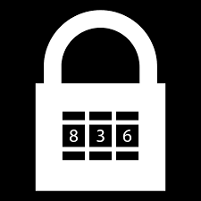

## Development - Intermediate, exercise 7

### Text
Write the body of the following Python function:

```
def solve(n1, n2, n3):
    # to complete
```

The function takes three positive integers in input representing the maximum values that can be specified in the dials of the combination lock shown in the following picture, where `n1` refers to the first dial on the left, `n2` refers to the central dial, and `n3` refers to the dial on the right:

</img>

In particular, if any of the input integers is *n* it means that the related dial of the lock can assume any number from *0* to *n* included (e.g. if `n1` is *4*, one can specify any number among *0*, *1*, *2*, *3*, and *4* in that dial). In order to check, in the body of your function, if a certain combination opens the lock, you can use an external function `open_it(comb)` (provided, not to be implemented) that takes in input a tuple of three non-negative integers defining a particular combination and return `True` if the combination opens the lock, `False` otherwise.

The function `solve` must return the tuple of the combination that opens the lock.


### Solution
```python
# Test case for the function
def test_solve(n1, n2, n3, expected):
    result = solve(n1, n2, n3)
    if expected == result:
        return True
    else:
        return False


# Code of the function
def solve(n1, n2, n3):
    for i in range(n1 + 1):
        for j in range(n2 + 1):
            for k in range(n3 + 1):
                if open_it((i, j, k)):
                    return i, j, k


# This variable and the related function is provided. The 
# function checks if the combination in input opens the lock
combination = 8, 3, 6
def open_it(comb):
    return comb == combination


# Tests
print(test_solve(9, 9, 9, combination))
print(test_solve(8, 5, 9, combination))
print(test_solve(8, 3, 6, combination))
``` 

### Additional material
The runnable [Python file](exercise_7.py) is available online.
