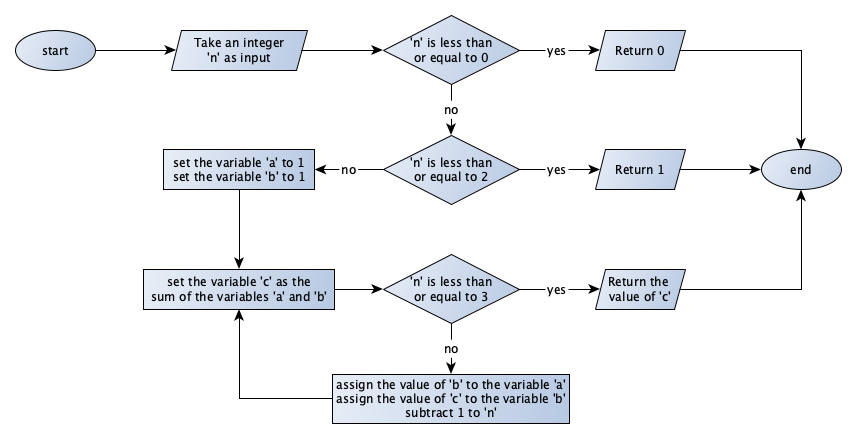
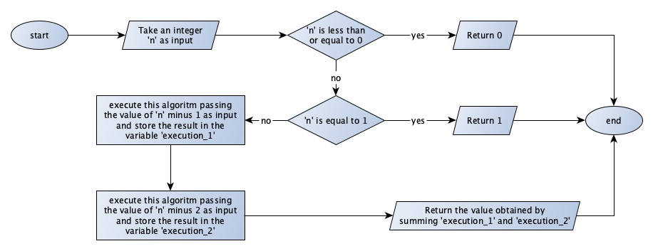

## Chapter ["Algorithms"](https://comp-think.github.io/book/02.pdf), exercise 3

### Text
The previous chapter, entitled [“Introduction to Computational Thinking”](https://comp-think.github.io/book/01.pdf), illustrates two different algorithms, expressed in natural language, for implementing the Fibonacci function. Create two distinct flowcharts to implement both of them.

### Answer
#### Flowchart for Fibonacci, definition 1

#### Flowchart for Fibonacci, definition 2

### Additional Material
The PNG files of the [first](exercise-3-def1.png) and [second](exercise-3-def2.png) flowcharts and the source GraphML files (about [definition 1](exercise-3-def1.graphml) and [definition 2](exercise-3-def2.graphml), that can be open and modified with [yEd](https://www.yworks.com/products/yed)) are available online.